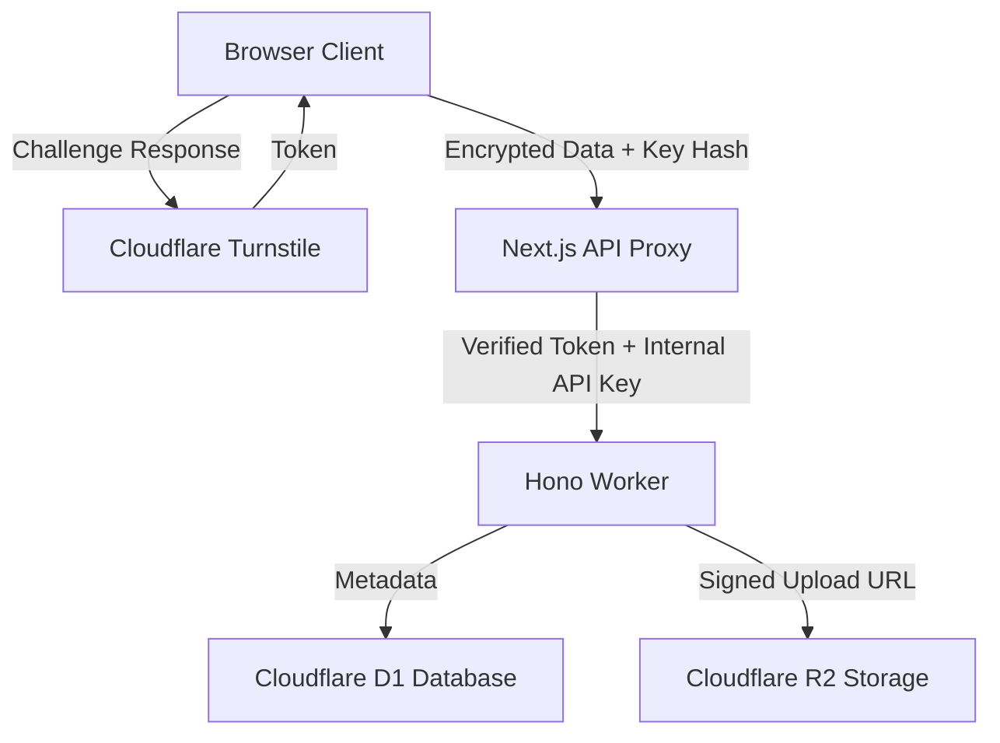

# 🛡️ DarkCodec: Swiss-Grade Secret Vault

**DarkCodec** is a production-ready, zero-knowledge secret sharing platform. It is designed with a "Swiss Security" philosophy—where privacy is non-negotiable and the service provider (us) never has access to the plaintext or the decryption keys.

[](https://nextjs.org/)
[](https://workers.cloudflare.com/)
[](https://en.wikipedia.org/wiki/Zero-knowledge_proof)

---

## 🏗️ Architecture

DarkCodec uses a layered **Backend-for-Frontend (BFF)** architecture to maximize security and privacy.



### Key Components
- **Frontend (Web)**: A premium Next.js 16+ application using `framer-motion` for fluid animations and `shadcn/ui` for a sleek aesthetic.
- **API Proxy (BFF)**: Secure Next.js routes that hide the `WORKER_URL` and `API_KEY` from the public.
- **Compute (Worker)**: A lightweight, edge-native Hono application running on Cloudflare Workers.
- **Storage (R2 & D1)**: Distributed object storage and SQL database for high scalability.

---

## 🔒 Security Measures

- **Client-Side AES-256-GCM**: Data is encrypted *before* it leaves your browser. The decryption key is passed in the URL fragment (`#`), which is never sent to the server.
- **Invisible Bot Protection**: Integrated with **Cloudflare Turnstile** to prevent automated abuse.
- **Privacy Screen Protection**:
    - **Blur on Inactive**: The view page automatically blurs content when the window loses focus.
    - **Press and Hold to Reveal**: Secrets are hidden by default and only visible while holding a dedicated reveal button.
    - **Anti-Copy/Selection**: Right-click and text selection are disabled on sensitive content to prevent easy data capture.
    - **Print Protection**: CSS-based protection that hides content and shows a warning when attempting to print (Ctrl+P).
- **Secure Proxies**: All backend infrastructure is shielded behind a Next.js proxy layer.
- **Ephemeral Storage**: Features "Burn-on-Read" and configurable expiration (1H, 1D, 1W) with automated edge cleanup.
- **Keyed Rate Limiting**: Protects against resource exhaustion without tracking user IPs, maintaining 100% anonymity.

---

## 🚀 Getting Started

### Prerequisites
- Node.js >= 18
- [pnpm](https://pnpm.io/)
- Cloudflare Account (for R2, D1, and Workers)

### Installation
```bash
git clone https://github.com/your-username/DarkCodec.git
cd DarkCodec
pnpm install
```

### Configuration

#### Frontend (`apps/web/.env`)
```env
# Cloudflare Turnstile
NEXT_PUBLIC_TURNSTILE_SITE_KEY=your_site_key
TURNSTILE_SECRET_KEY=your_secret_key

# Internal Proxy (BFF)
WORKER_API_URL=https://your-worker.workers.dev
WORKER_API_KEY=your_secure_random_key
```

#### Backend (`apps/worker/.dev.vars`)
```env
API_KEY=your_secure_random_key
ALLOWED_ORIGINS=http://localhost:3000,https://your-site.com
```

### Local Development
```bash
# Start the Worker and Frontend simultaneously
pnpm dev
```

---

## 🐳 Docker Orchestration

DarkCodec is fully containerized for both local development and production-like environments. The stack uses `docker-compose` to orchestrate the Next.js frontend and the Hono-based worker.

### Running with Docker Compose

```bash
# Build and start all services (web and worker)
docker-compose up --build
```

- **Frontend**: Accessible at `http://localhost:3000`
- **Worker API**: Accessible at `http://localhost:8787`

The worker container uses a Debian-based environment to optimize compatibility with the `workerd` engine and provides a simulated local environment for testing.

---

## 📡 Backend API Documentation

The worker provides a secure REST API protected by `X-API-Key`.

### 1. Create a Secret Message
```bash
curl -X POST https://your-worker.workers.dev/message \
  -H "X-API-Key: YOUR_API_KEY" \
  -H "Content-Type: application/json" \
  -d '{
    "type": "message",
    "cipherText": "ENCRYPTED_DATA",
    "iv": "AES_IV",
    "expiresIn": 24,
    "burnAfterRead": true
  }'
```

### 2. Request a File Upload Link
```bash
curl -X POST https://your-worker.workers.dev/presign \
  -H "X-API-Key: YOUR_API_KEY" \
  -H "Content-Type: application/json" \
  -d '{
    "fileName": "document.pdf",
    "fileType": "application/pdf"
  }'
```

### 3. Retrieve a Secret (Public)
```bash
curl https://your-worker.workers.dev/SECRET_ID
```

---

## 🛠️ Roadmap & Future Enhancements

- [ ] **Secure Chat (In Development)**: Real-time, E2EE ephemeral messaging with identity verification.
- [ ] **Native Mobile Support**: Progressive Web App (PWA) parity for secure mobile access.
- [ ] **Multi-File Vaults**: Encrypt and share multiple files concurrently within a single link.
- [ ] **Password protection**: Optional second-layer password (KDF-based) for high-value secrets.
- [ ] **Read Notifications**: Passive, privacy-preserving notification when a secret is burned.
- [ ] **Edge Logging**: Anonymous audit logs for server operators to monitor health.

---

## 📄 License
MIT License. Built with ❤️ for privacy by the DarkCodec.
